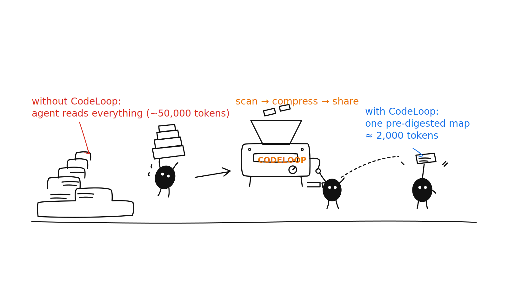
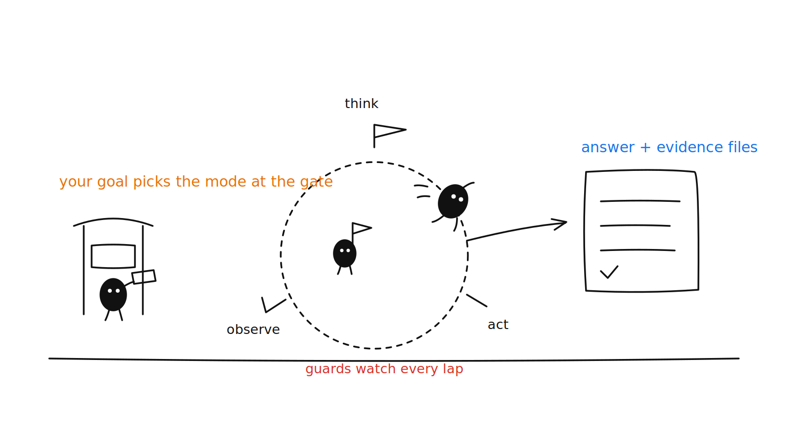
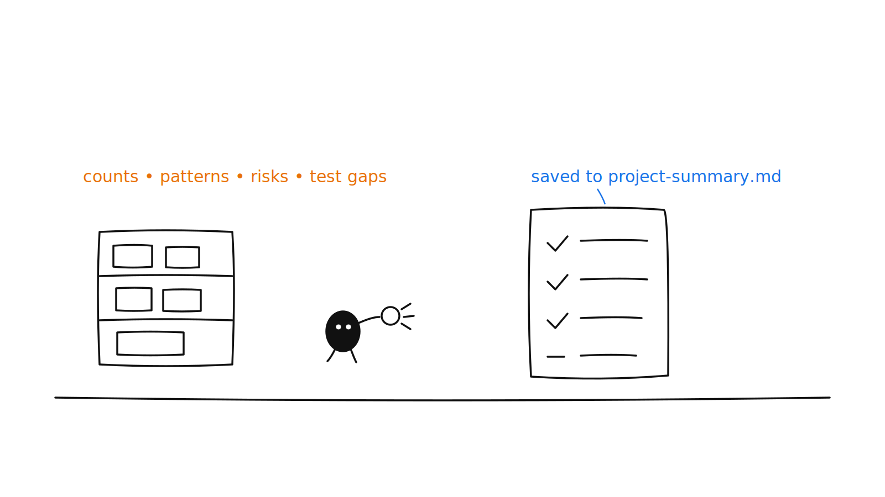
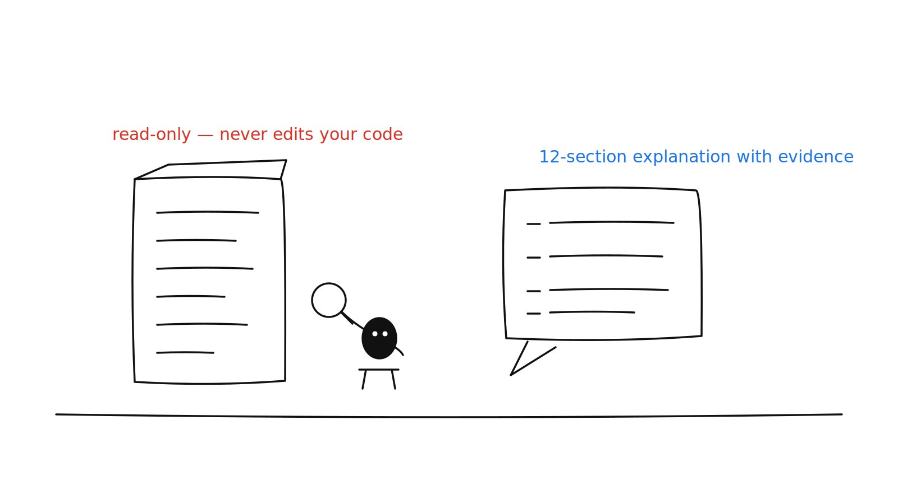
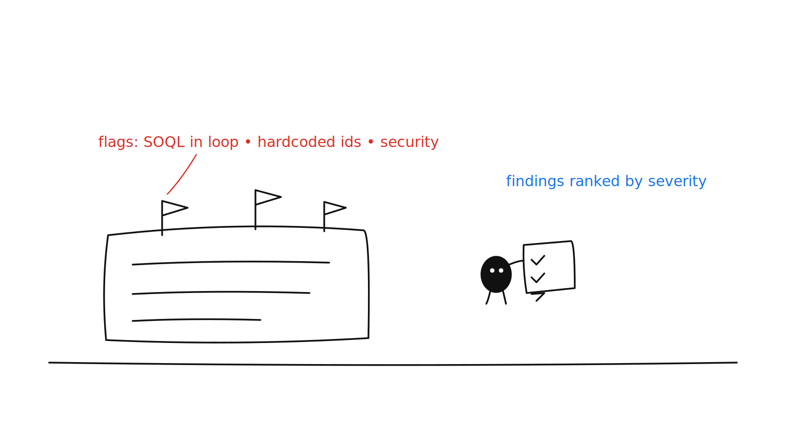
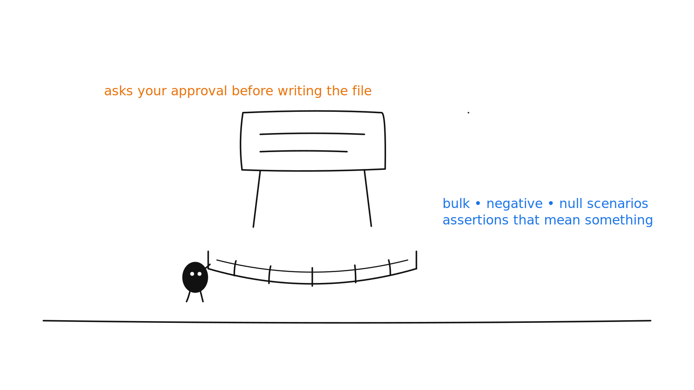
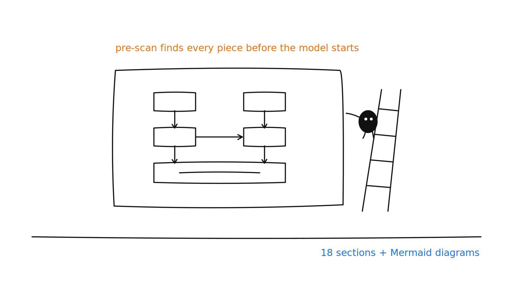
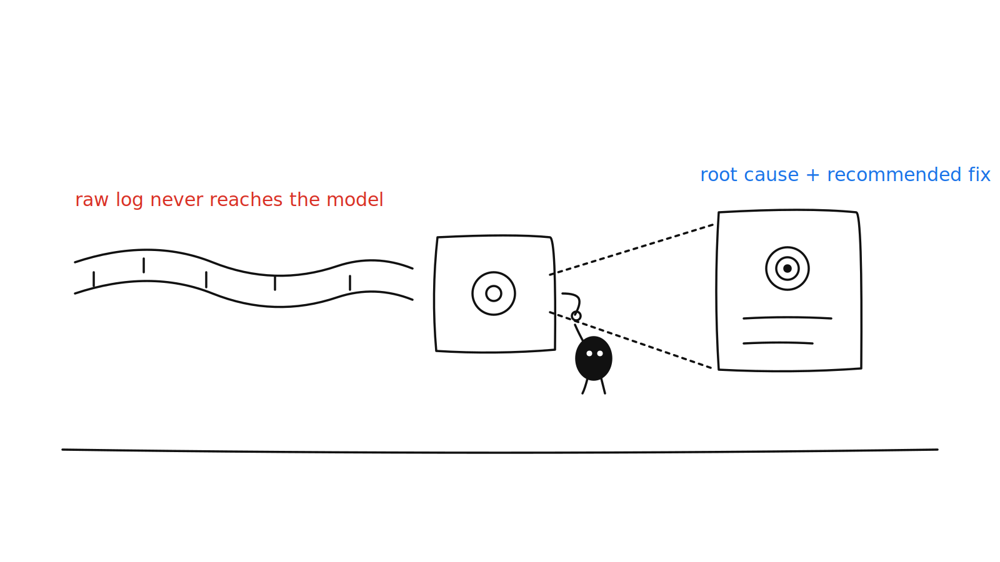

# CodeLoop AI

   

A Salesforce-aware recursive coding agent for VS Code. Runs fully local by default with your own Ollama model — no cloud, no API keys, no data leaving your machine. Optionally switch to Claude (Anthropic), OpenAI, or VS Code's Language Model API (Copilot). The agent "learns" through markdown memory files — not model training.



```
Goal → Think → Act → Observe → Reflect → Improve Plan → Repeat (per-mode iteration limit)
```

Every run: the goal is classified into a task mode → Salesforce instructions load from `.codeloop/` → the model picks one JSON action per iteration → results feed back as observations → a structured reflection is saved to memory.

## Quick start

Requires VS Code 1.85+, Node.js 18+, and [Ollama](https://ollama.com) running locally (`ollama serve`) with `ollama pull qwen3-coder:latest`.

```bash
git clone https://github.com/HariGit/codeloop-ai.git
cd codeloop-ai
npm install && npm run compile
npm install -g @vscode/vsce && vsce package
code --install-extension codeloop-ai-0.1.0.vsix
```

Then in your Salesforce project: copy `.codeloop/` in, run **Scan Salesforce Project** once, and go. Output appears in **View → Output → CodeLoop AI**.

## Commands

| Command | Input | What it does |
|---|---|---|
| **Start Agent** | free-form goal | Runs the agent with automatic mode detection |
| **Explain Apex Class** | class name | Read-only 12-section explanation |
| **Review Apex Class** | class name | Best-practices / bulkification / security review |
| **Create Apex Test Class** | class name | Writes a test class (with your approval) |
| **Analyze Flow Migration** | Flow API name | Analysis + migration plan |
| **Architecture Overview** | object / class / feature | 18-section document with Mermaid diagrams |
| **Analyze Apex Debug Log** | log file path | LogLens: root cause, exceptions, governor risks |
| **Deployment Review** | metadata / notes | Risk assessment + validate/deploy commands |
| **Scan Salesforce Project** | — | Deep metadata scan → `.agent-memory/project-summary.md` |
| **Generate Agent Context Files** | pick targets | CLAUDE.md / AGENTS.md / copilot-instructions.md |

## Feature guide

<details>
<summary><b>1. Start Agent — the free-form loop</b></summary>



1. `Ctrl+Shift+P` → **CodeLoop AI: Start Agent** → type any goal, e.g. *"find where case comments trigger emails and check for hardcoded addresses"*.
2. **The gate:** your phrasing picks the task mode — "explain/review" stays read-only, "fix/create" unlocks editing, "debug log" unlocks LogLens. The chosen mode is the first line in the output channel.
3. **The laps:** each iteration the model returns one JSON action (search / read / edit / run / answer). CodeLoop executes it — enforcing the mode allowlist, blocking sensitive paths, asking approval for writes — and feeds the observation back with the goal re-anchored.
4. **The guards:** duplicate actions are replayed from cache, repeated blocked actions stop the run, the last lap demands an answer, and a wrap-up guarantees you never get nothing.
5. **The exit:** the final answer is validated against what actually happened and printed with evidence files. A reflection lands in `.agent-memory/` to improve the next run.

</details>

<details>
<summary><b>2. Scan Salesforce Project — know your org first</b></summary>



1. Open your Salesforce DX project in VS Code.
2. `Ctrl+Shift+P` → **CodeLoop AI: Scan Salesforce Project**.
3. Read the result in the output channel or `.agent-memory/project-summary.md`.
4. Re-run after big metadata changes — every agent run plans with this summary.

</details>

<details>
<summary><b>3. Explain Apex Class — understand before touching</b></summary>



1. `Ctrl+Shift+P` → **CodeLoop AI: Explain Apex Class** → enter the class name.
2. The agent finds the class, its page/LWC/trigger/test, reads them, and stops.
3. You get a 12-section explanation (Purpose → Evidence Files). It never edits anything.

</details>

<details>
<summary><b>4. Review Apex Class — find the problems</b></summary>



1. `Ctrl+Shift+P` → **CodeLoop AI: Review Apex Class** → enter the class name.
2. The agent checks the 9-point standards list: SOQL/DML in loops, bulkification, hardcoded values, sharing, tests.
3. Findings come back ranked Critical → Low with file:line references and fixes. Read-only.

</details>

<details>
<summary><b>5. Create Apex Test Class — with your approval</b></summary>



1. `Ctrl+Shift+P` → **CodeLoop AI: Create Apex Test Class** → enter the class name.
2. The agent reads the class and existing test patterns first.
3. An approval dialog shows the new file with a preview — nothing is written until you click Approve.
4. Scenarios covered: positive, negative, null, and 200+ record bulk, with real assertions.

</details>

<details>
<summary><b>6. Architecture Overview — the big picture</b></summary>



1. `Ctrl+Shift+P` → **CodeLoop AI: Architecture Overview** → enter an object, class, feature, or flow name.
2. A pre-scan (plain TypeScript, zero tokens) finds every related component and hands the model the inventory.
3. The agent reads only the key files and produces an 18-section document ending with Mermaid flow + sequence diagrams.

</details>

<details>
<summary><b>7. Analyze Apex Debug Log — LogLens</b></summary>



1. Download a log into the workspace (e.g. `sf apex log get`).
2. `Ctrl+Shift+P` → **CodeLoop AI: Analyze Apex Debug Log** → enter the log path.
3. The extension parses the log itself — the model only sees a ~1KB structured report (timeline, call tree, SOQL/DML, exceptions, limits).
4. The answer ends with Root Cause → Recommended Fix → Evidence Files.

</details>

<details>
<summary><b>8. Generate Agent Context Files — feed the other agents</b></summary>

Illustrated by the hero image at the top of this page.

1. `Ctrl+Shift+P` → **CodeLoop AI: Generate Agent Context Files**.
2. Pick targets: CLAUDE.md, AGENTS.md, `.github/copilot-instructions.md` (all pre-selected).
3. Claude Code / Codex / Copilot now start every session pre-oriented — your notes outside the managed `<!-- CODELOOP:BEGIN/END -->` block are preserved.

</details>

_All illustrations in the style of [Ian Xiaohei Illustrations](https://github.com/helloianneo/ian-xiaohei-illustrations) (MIT)._

## Configuration

<details>
<summary><b>Model providers — Ollama (default), Claude, OpenAI, Copilot</b></summary>

| Provider | Setting requirements |
|---|---|
| `ollama` (default) | Ollama running locally; `codeloopAi.model` = e.g. `qwen3-coder:latest` |
| `anthropic` | `codeloopAi.anthropicApiKey`; model e.g. `claude-sonnet-4-5` |
| `openai` | `codeloopAi.openAiApiKey`; model e.g. `gpt-4o` |
| `vscode-lm` | VS Code 1.90+ with Copilot signed in; model = family, e.g. `gpt-5-mini` |

**Claude:** create a key at [console.anthropic.com](https://console.anthropic.com), then:

```json
"codeloopAi.provider": "anthropic",
"codeloopAi.anthropicApiKey": "sk-ant-...",
"codeloopAi.model": "claude-sonnet-4-5"
```

**OpenAI (Codex):** key from [platform.openai.com](https://platform.openai.com); provider `openai`, model `gpt-4o` (Chat Completions models; the dedicated Codex agent API is not wired in).

**Copilot:** no key — provider `vscode-lm`, model = family in lowercase-hyphen form (`gpt-4o`, `gpt-5-mini`, `claude-sonnet-4-5`); approve the one-time consent prompt on first run. Unknown families fall back to Copilot's first available model.

All providers normalize responses identically — modes, guards, approvals, and memory behave the same. Unconfigured providers fail with the exact setting name to fix. Treat API keys like passwords; never commit them.

</details>

<details>
<summary><b>Settings reference</b></summary>

| Setting | Default |
|---|---|
| `codeloopAi.provider` | `ollama` |
| `codeloopAi.model` | `qwen3-coder:latest` |
| `codeloopAi.ollamaEndpoint` | `http://localhost:11434/api/chat` |
| `codeloopAi.ollamaNumCtx` | `32768` (context window; lower if RAM-constrained) |
| `codeloopAi.anthropicApiKey` / `openAiApiKey` / `apiKey` | (empty) |
| `codeloopAi.loop.defaultMaxIterations` | `8` |
| `codeloopAi.loop.absoluteMaxIterations` | `20` (hard ceiling) |
| `codeloopAi.loop.modeMaxIterations` | per-mode (EXPLAIN 4 … CREATE_TEST 10) |
| `codeloopAi.loop.jsonRetries` / `answerValidationRetries` | `2` |
| `codeloopAi.loop.noProgressLimit` | `2` |
| `codeloopAi.loop.autoStopExplainAfterFiles` | `true` |

</details>

<details>
<summary><b>Task modes — what the goal phrasing unlocks</b></summary>

| Mode | Trigger keywords | Actions allowed | Max iterations |
|---|---|---|---|
| EXPLAIN_APEX | explain, guide, understand | read-only | 4 |
| REVIEW_APEX | review, best practices, bulkify | read-only | 6 |
| MODIFY_APEX | fix, update, refactor | + editing | 8 |
| CREATE_TEST | test class, coverage | + editing + run | 10 |
| FLOW_MIGRATION | flow to apex, migrate flow | read-only | 8 |
| LWC_WORK | lwc, component, wire | + editing | 8 |
| INTEGRATION_API | rest api, endpoint, dto | + editing | 8 |
| DEPLOYMENT_REVIEW | deployment, package.xml | read-only | 6 |
| DEBUG_LOG_ANALYSIS | debug log, apex log | read-only + log tools | 6 |
| ARCHITECTURE_OVERVIEW | architecture, system design, HLD | read-only | 8 |
| GENERAL_SALESFORCE | (default) | read-only | 6 |

Read-only modes gain editing/run access only when the goal explicitly asks (e.g. "review the class **and fix the code**"). All limits configurable, capped by `absoluteMaxIterations`.

</details>

## Safety

<details>
<summary><b>Tools, approvals, and the blocklist</b></summary>

| Tool | Approval |
|---|---|
| `read_file` | automatic (sensitive paths blocked: .env, keys, .git, .sf, credential filenames) |
| `search_code` | automatic (Salesforce-aware, max 25 results) |
| `create_file` | dialog with preview — new files only |
| `replace_range` | dialog with BEFORE/AFTER of the exact lines |
| `apply_patch` | dialog with the unified diff |
| `replace_file` / `write_file` | dialog flagged FULL OVERWRITE (HIGH risk) |
| `run_command` | dialog with command, reason, risk level |
| LogLens tools | automatic (read-only log analysis) |

**Always blocked, never executed:** `rm -rf`, `del /s`, `format`, `mkfs`, `git reset --hard`, `git clean -f`, remote scripts piped to shell, `npm install` from URLs/tarballs.

**Always HIGH risk (approval required):** `sfdx force:source:deploy`, `sf project deploy`, org data changes, `npm install`, `git push`.

Every approve/reject/block decision is logged to `.agent-memory/action-history.md`.

</details>

<details>
<summary><b>Anti-hallucination guards</b></summary>

- **Final answer validation** — claims of *created/updated/modified/wrote* require a successful edit this session; *ran/executed/tested/deployed* require a successful run_command. Violations are rejected.
- **Evidence files** — final answers list the files actually read, validated against session history.
- **Goal anchoring + session recap** — every observation repeats the goal and the actions already completed.
- **Duplicate guard** — repeated identical reads/searches replay the earlier result.
- **No-progress stop** — consecutive blocked/duplicate iterations end the run early.
- **Forced wrap-up** — if iterations run out or JSON keeps failing, an extra call (then a plain-text fallback) still extracts an answer. You never get nothing.
- **Structured output** — Ollama's JSON-schema `format` constrains actions; a large `num_ctx` prevents truncation-mangled JSON.

</details>

## Salesforce intelligence

<details>
<summary><b>.codeloop/ instruction system (Copilot-style custom instructions)</b></summary>

```
.codeloop/
  instructions/salesforce-instructions.md   ← global standards (always loaded)
  agents/*.agent.md                         ← 9 role definitions
  prompts/*.prompt.md                       ← 7 reusable prompt templates
  skills/*.md                               ← 8 best-practice references
```

Copy this folder into each Salesforce project you analyze. Edit the markdown to change how the agent works — no code changes. Built-in standards: Trigger → Domain → Service → Selector; SOQL/DML outside loops; selector classes; bulkified logic; no hardcoded values; separate request/response DTOs; tests checked before Apex changes; clear LWC error handling.

</details>

<details>
<summary><b>Scanner, search, and memory</b></summary>

**Scanner** — counts all metadata; object summaries (fields/record types/validation rules); trigger and flow summaries; heuristic Apex risk scan (SOQL/DML in loops, hardcoded emails/URLs/Ids — top 50); test-coverage mapping.

**Search** — identifier-aware: `AccountService` returns the exact class, its test classes, VF pages using it as controller, matching LWC and Flows, then references ranked by metadata type. Noise (`.sf`, `.git`, `node_modules`, `maxRevision.json`) excluded.

**Memory (`.agent-memory/`)** — `project-rules.md`, `project-summary.md`, `learned-patterns.md`, `salesforce-decisions.md` are read before every plan; `reflections.md`, `failed-attempts.md`, `action-history.md` are written as the agent works. All entries size-capped and secret-redacted.

</details>

<details>
<summary><b>How agents use CodeLoop (incl. Claude Code / Codex / Copilot)</b></summary>

| Feature | CodeLoop's own agent | External agents |
|---|---|---|
| Task modes + allowlists | automatic | benefit from disciplined outputs |
| `.codeloop/` instructions | injected per mode | readable by any agent |
| Project scanner | read before every plan | summarized into CLAUDE.md |
| Architecture analyzer | inventory injected | shareable 18-section document |
| LogLens | model sees only the ~1KB report | hand the report to any agent |
| Safe editing + approvals | previewed and risk-assessed | `action-history.md` audit trail |
| Memory (7 files) | read before planning | shared brain across tools |
| Agent context files | — | CLAUDE.md / AGENTS.md / copilot-instructions.md auto-read |
| Model providers | Ollama/Claude/GPT/Copilot | — |
| Anti-hallucination guards | automatic | outputs always cite evidence |

Workflow: (1) once per project — copy `.codeloop/`, Scan, Generate Agent Context Files; (2) Salesforce tasks → CodeLoop; (3) general coding → Claude Code/Codex/Copilot, pre-oriented; (4) after big changes — re-scan and regenerate. Planned next: an MCP server exposing LogLens, search, scanner, and the architecture inventory as live tools.

</details>

## For developers

<details>
<summary><b>Architecture</b></summary>

```
src/
  extension.ts                  Entry point: commands, settings → AgentConfig/LoopConfig
  agent/
    agentLoop.ts                Core loop: guards, validation, wrap-up, evidence
    taskModeDetector.ts         Goal → 11 task modes + allowlist
    instructionLoader.ts        Loads .codeloop/ (safe, traversal-blocked)
    architectureAnalyzer.ts     Pre-scan inventory for ARCHITECTURE_OVERVIEW
    agentContextGenerator.ts    CLAUDE.md / AGENTS.md / copilot-instructions.md
    prompts.ts                  System/mode/observation/reflection prompts
    responseTemplates.ts        Fixed final-answer formats per mode
    tools.ts                    read/search/edit/run + risk assessment
    salesforceScanner.ts        DX scanner: counts, summaries, risks, test map
    memory.ts                   .agent-memory files, redaction
  loglens/                      Debug log parser / analyzer / report builders
  llm/                          ModelProvider + Ollama/Anthropic/OpenAI/VsCodeLM
  tools/                        ToolRegistry + Native/LogLens/Mcp providers
  types/agentTypes.ts           Shared types, action schema, LoopConfig
  test/runTests.ts              Unit tests (npm test)
```

Runtime flow: goal → mode → .codeloop context (+ architecture inventory) → loop (one JSON action per iteration through ToolRegistry with approvals) → validated final answer → memory. Extension seams: new provider = one file + factory case; new tools register in ToolRegistry; new behavior = markdown edit in `.codeloop/`.

</details>

<details>
<summary><b>Testing, packaging, debugging</b></summary>

**Test:** `npm test` — compiles, then 23 dependency-free unit tests with a stubbed vscode API.

**Package:** `npm run compile && vsce package` — `.vscodeignore` ships only `out/`, `package.json`, README, and `.codeloop/` templates.

**Debug:** Output channel (View → Output → CodeLoop AI) shows mode, iterations, observations, blocked/rejected events. `.agent-memory/failed-attempts.md` and `action-history.md` explain odd behavior. F5 opens an Extension Development Host with breakpoints in the TypeScript. Repeated "Invalid JSON" on Ollama = context truncation → keep `codeloopAi.ollamaNumCtx` large. Isolate Ollama: `curl http://localhost:11434/api/chat -d '{"model":"qwen3-coder:latest","messages":[{"role":"user","content":"hi"}],"stream":false}'`.

</details>

## License

MIT
